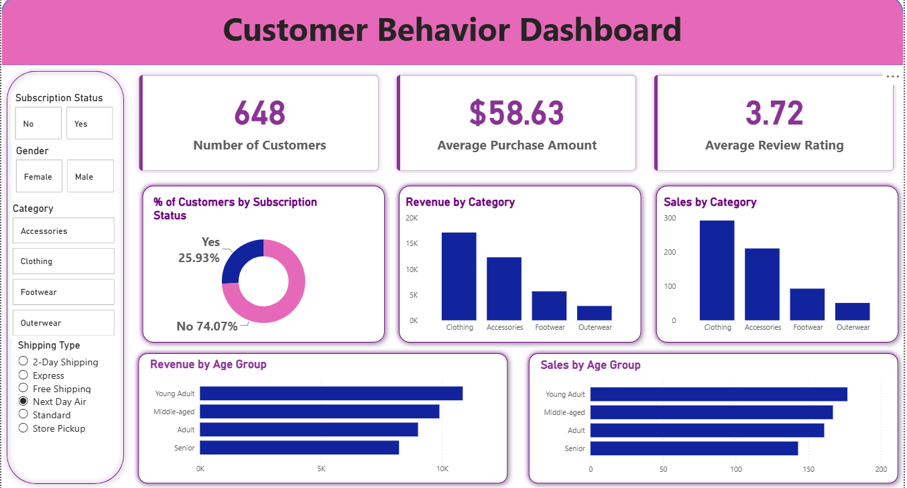

# 🛍️ Customer Shopping Behavior Analysis

An end-to-end data analysis project exploring customer shopping behavior — from raw data cleaning in Python, to insight-generation with SQL, to an interactive Power BI dashboard.



## 📌 Overview

This project analyzes a customer shopping behavior dataset to uncover patterns in spending, discounts, subscriptions, product preferences, and demographics. The workflow covers the full analytics pipeline:

1. **Data Cleaning & Feature Engineering** (Python / Pandas) — handling missing values, standardizing column names, and creating derived features like `age_group` and `purchase_frequency_days`.
2. **Business Question Analysis** (SQL / PostgreSQL) — 10 analytical queries answering key business questions.
3. **Interactive Dashboard** (Power BI) — a visual summary of customer behavior for stakeholders to explore.

## 🧰 Tools & Technologies

- **Python** (Pandas) — data cleaning and preprocessing
- **SQLAlchemy** — loading cleaned data from Python into a SQL database
- **Power BI** — dashboard design and visualization
- **Jupyter Notebook** — analysis workflow and documentation

## 📁 Project Structure

```
├── Customer_Shopping_Behavior_Analysis.ipynb   # Data cleaning & feature engineering
├── customer_behavior_sql_queries.sql           # 10 business-question SQL queries
├── customer_behavior_dashboard.pbix            # Power BI dashboard file
├── Customer Shopping Behavior Analysis.pdf     # Conclusions about analysis in pdf file
├── customer_shopping_behavior.csv              # Raw Data
└── README.md
```

## 🧹 Data Cleaning & Feature Engineering

- Imputed missing `review_rating` values using the median rating per product category
- Standardized column names to snake_case
- Renamed `purchase_amount_(usd)` → `purchase_amount`
- Engineered `age_group` (Young Adult, Adult, Middle-aged, Senior) using quartile binning on age
- Engineered `purchase_frequency_days` by mapping purchase frequency labels (e.g., "Weekly", "Monthly") to numeric day values
- Identified that `discount_applied` and `promo_code_used` were identical across all rows and dropped the redundant column
- Loaded the cleaned dataset into a SQL database for querying

## 🔍 Business Questions Answered (SQL)

| # | Question |
|---|----------|
| 1 | Total revenue generated by male vs. female customers |
| 2 | Customers who used a discount but still spent above the average purchase amount |
| 3 | Top 5 products by average review rating |
| 4 | Average purchase amount: Standard vs. Express shipping |
| 5 | Average spend and total revenue: subscribers vs. non-subscribers |
| 6 | Top 5 products by discount usage rate |
| 7 | Customer segmentation (New / Returning / Loyal) by purchase history |
| 8 | Top 3 most purchased products within each category |
| 9 | Subscription likelihood among repeat buyers (5+ previous purchases) |
| 10 | Revenue contribution by age group |

Full queries are available in [`customer_behavior_sql_queries.sql`](customer_behavior_sql_queries.sql).

## 📊 Dashboard Highlights

The Power BI dashboard (`customer_behavior_dashboard.pbix`) provides an interactive view with filters for **subscription status, gender, category, and shipping type**, alongside:

- **648** total customers, **$58.63** average purchase amount, **3.72** average review rating
- Revenue and sales breakdown by product category
- Revenue and sales breakdown by age group
- Subscription status distribution (74.07% not subscribed vs. 25.93% subscribed)

## 🚀 How to Reproduce

1. Clone this repository
2. Open `Customer_Shopping_Behavior_Analysis.ipynb` to run the data cleaning and feature engineering steps
3. Load the cleaned data into your SQL database of choice (PostgreSQL, MySQL, or SQL Server connection snippets are included in the notebook)
4. Run the queries in `customer_behavior_sql_queries.sql` against the loaded table
5. Open `customer_behavior_dashboard.pbix` in Power BI Desktop to explore the dashboard

> **Note:** If you clone the notebook, update the database credentials in the connection cells with your own — do not commit real credentials to GitHub.

## 👤 Author

**Roshni Kumari**
- GitHub: [RoshniKumari26](https://github.com/RoshniKumari26)
- LinkedIn: [roshnikumari2604](https://www.linkedin.com/in/roshnikumari2604/)
